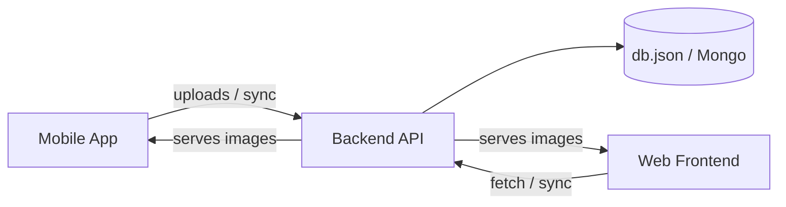

# mitraM

MitraM — Gujarati community accounting and ledger management platform.

This repository contains three parts:
- Mobile: Flutter mobile client (mobile/)
- Backend: Node.js + Express demo server (backend/)
- Frontend: React + Vite demo frontend (શુભ-વ્યાપાર (1)/)

## Quick Links
- Frontend: `શુભ-વ્યાપાર (1)/`
- Backend: `backend/`
- Mobile: `mobile/`

## Goals
- Simple, local-first ledger and member management
- Multi-year calculations and reports
- Small demo server for API, assets and time sync

## Architecture & Flow



## Setup (local)

Prereqs: Node 18+, npm, tsx (dev), Flutter SDK (for mobile)

- Install backend deps

```bash
cd backend
npm ci
```

- Run backend tests (Jest)

```bash
cd backend
npm test
```

- Run frontend dev server (dev server uses `tsx` for TypeScript execution)

```bash
cd "શુભ-વ્યાપાર (1)"
npm install
npm run dev
```

- Run mobile app (Flutter)

```bash
cd mobile
flutter pub get
flutter run
```

## API Reference (demo server)

- `GET /api/data` — Returns latest dataset. Response includes `serverTime` and `currentYear`. Cache-Control: `public, max-age=300`.
- `GET /api/time` — Lightweight server time endpoint. Returns `{ serverTime, tz }`.
- `GET /api/image/member/:idx` — Returns member photo by index (served from `assets/.aistudio` mapping).
- `GET /api/image/hanuman-*` — Returns hanuman dada images by name.
- `GET /api/image/group-photo` — Returns group photo image.

Backend routes (example)
- `POST /auth/login`
- `GET /members` — list members
- `GET /transactions` — list transactions
- `GET /reports/yearly` — yearly reports

Note: The demo server includes helpers to serve mobile images copied into `assets/.aistudio` and exposes `serverTime` so the frontend/mobile can stay in sync.

## Calculations
- The core calculator lives in `backend/services/calculator.js` and aligns with frontend logic.
- `calculateEkandKul` subtracts `holding` from totals to match frontend presentation.
- Current default year is `2026` (variable `currentYear` / `year2026`) and the frontend uses this dynamically.

## Frontend notes
- The frontend was refactored to accept `currentYear` from `/api/data` and compute holdings dynamically.
- Polling frequency reduced to 5 minutes; app also fetches on window focus to reduce load.
- An `ErrorBoundary` component was added at `src/components/ErrorBoundary.tsx` to prevent full-app crashes.

## CI
- A lightweight GitHub Actions workflow runs `npm run typecheck` on push/PR to `main`.

## Commit hygiene
- This repo was consolidated at the workspace root and committed with focused, small commits per folder (mobile, backend, frontend, assets, docs).

## Troubleshooting
- If `npm run dev` on frontend shows runtime `ReferenceError`, ensure TypeScript build passes: `npm run typecheck`.
- If backend tests hang, check for processes using the demo port (kill or change port in `backend/server.js`).

## Contact / Contributors
- Maintainer: Kalp Patel
