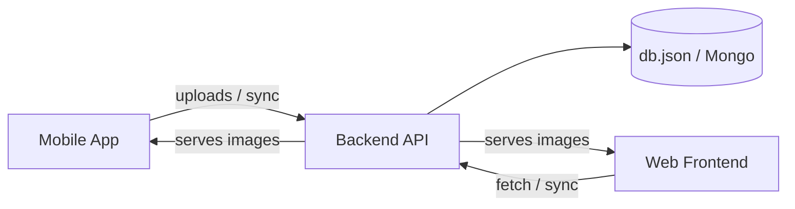
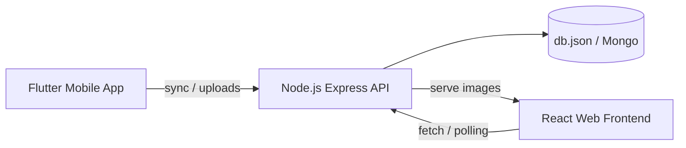

# mitraM

MitraM — Gujarati community accounting and ledger management platform.

This repository contains three parts:
- Mobile: Flutter mobile client (mobile/)
- Backend: Node.js + Express demo server (backend/)
- Frontend: React + Vite demo frontend (શુભ-વ્યાપાર (1)/)

## Quick Links
- Frontend: `શુભ-વ્યાપાર (1)/`
- Backend: `backend/`
- Mobile: `mobile/`

## Goals
- Simple, local-first ledger and member management
- Multi-year calculations and reports
- Small demo server for API, assets and time sync

## Architecture & Flow



## Setup (local)

Prereqs: Node 18+, npm, tsx (dev), Flutter SDK (for mobile)

- Install backend deps

```bash
cd backend
npm ci
```

- Run backend tests (Jest)

```bash
cd backend
npm test
```

- Run frontend dev server (dev server uses `tsx` for TypeScript execution)

```bash
cd frontend
npm install
npm run dev
```

- Run mobile app (Flutter)

```bash
cd mobile
flutter pub get
flutter run
```

## API Reference (demo server)

- `GET /api/data` — Returns latest dataset. Response includes `serverTime` and `currentYear`. Cache-Control: `public, max-age=300`.
- `GET /api/time` — Lightweight server time endpoint. Returns `{ serverTime, tz }`.
- `GET /api/image/member/:idx` — Returns member photo by index (served from `assets/.aistudio` mapping).
- `GET /api/image/hanuman-*` — Returns hanuman dada images by name.
- `GET /api/image/group-photo` — Returns group photo image.
# mitraM — Project Overview

This repository contains the full MitraM project: a Gujarati community accounting and reporting system with a Flutter mobile client, a React web frontend, and a Node.js backend used for demo APIs and data-sync.

Structure
- `mobile/` — Flutter mobile application (Android/iOS/web/desktop scaffolds)
- `backend/` — Node.js + Express demo server, services, models and tests
- `શુભ-વ્યાપાર (1)/` — Web frontend (React + Vite, TypeScript)
- `assets/`, `db.json`, and top-level scripts and configs

This README includes both English and Gujarati (ગુજરાતી) sections.

---

**English — End-to-end Guide**

Purpose
- MitraM helps small Gujarati community groups manage members, multi-year ledgers, and generate reports. It's designed to run locally with a small demo server and assets.

Architecture



Quickstart (local)
- Prereqs: Node.js (18+), npm, `tsx` (for running TypeScript server), Flutter SDK (for `mobile`)

Backend
```bash
cd backend
npm ci
npm test     # run Jest tests
node server.js   # or npm start (see backend/package.json)
```

Frontend (dev)
```bash
cd frontend
npm install
npm run dev    # runs tsx server.ts (dev server + static frontend)
```

Mobile (Flutter)
```bash
cd mobile
flutter pub get
flutter run
```

API (demo server)
- `GET /api/data` — latest dataset; includes `serverTime` and `currentYear`. Uses `Cache-Control: public, max-age=300` to reduce load.
- `GET /api/time` — lightweight server time endpoint: `{ serverTime, tz }`.
- `GET /api/image/member/:idx` — member photo by index (served from `assets/.aistudio`).
- `GET /api/image/hanuman-*` — serves Hanuman dada images.
- `GET /api/image/group-photo` — group photo image.

Backend example routes
- `POST /auth/login`
- `GET /members`
- `GET /transactions`
- `GET /reports/yearly`

Key implementation notes
- Core calculations: `backend/services/calculator.js` — aligned with frontend logic. `calculateEkandKul` subtracts `holding` when computing totals.
- Year handling: default/current year set to 2026; frontend reads `currentYear` from `/api/data` for dynamic UI.
- Performance: frontend polling reduced to 5 minutes and also fetches on window focus.
- Resilience: added `src/components/ErrorBoundary.tsx` in frontend to prevent full-app crashes.

CI and tooling
- Root workflow: `.github/workflows/ci.yml` runs `npm run typecheck` to catch TypeScript issues.
- Scripts: use `npm run typecheck` in frontend folder to validate types.

Security and excluded files
- Sensitive local files like `.env` are ignored via `.gitignore`. Do not commit secrets.
- Large user data (WhatsApp exports) are excluded from the repo.

Contributing and commits
- The repo history was consolidated into focused commits per area (mobile, backend, frontend, assets, docs). For resume/portfolio use, commits were kept small and descriptive.

---

**ગુજરાતી — અંતથી અંત સુધી માર્ગદર્શન**

ઉદ્દેશ
- MitraM નાના ગુજરાતી સમુદાય માટે એક સાદું અકાઉન્ટિંગ અને રિપોર્ટિંગ સોલ્યુશન છે. એમાં સભ્ય મેનેજમેન્ટ, વર્ષવાર લેજર અને રિપોર્ટ્સ બનાવવાના ફિચર્સ છે.

આર્કિટેક્ચર
- `mobile/` — Flutter મોબાઇલ એપ
- `backend/` — Node.js + Express API અને સેવાઓ
 - `frontend/` — વેબ ફ્રન્ટએન્ડ (React + Vite)

સ્થાપના અને ચલાવવાની રીત

બેકએન્ડ
```bash
cd backend
npm ci
npm test
node server.js
```

ફ્રન્ટએન્ડ (ડેવ)
```bash
cd "શુભ-વ્યાપાર (1)"
npm install
npm run dev
```

મોબાઈલ
```bash
cd mobile
flutter pub get
flutter run
```

API સૂચન આપનારાં અંતબિંદુઓ
- `GET /api/data` — તાજેતરની ડેટા સેટ, `serverTime` અને `currentYear` સાથે.
- `GET /api/time` — સર્વરનો સમય.
- `GET /api/image/member/:idx` — સભ્યનું ફોટો.

મહત્વપૂર્ણ નોંધ
- મુખ્ય ગણતરીઓ `backend/services/calculator.js` માં છે અને frontend સાથે મેલ ખાતી રીતે કાર્ય કરે છે.
- ડિફોલ્ટ વર્ષ 2026 છે અને ફ્રન્ટએન્ડ તે `currentYear` પરથી લે છે.

સુરક્ષા
- ગુપ્ત માહિતી `.env` ફાઈલમાં રાખો અને તેને રિપોઝિટોરીમાં ન મૂકો. `.gitignore`માં તે ઉમેરેલું છે.

સંપર્ક
- રાખનાર: Kalp Patel

---

If you want, I can also:
- Add a short `CONTRIBUTING.md` and `LICENSE` file
- Add backend CI (run Jest tests on push)
- Create a compact `SUMMARY.md` for resume display with commit list

---

Thank you — updates were committed and pushed to `origin/main` on your repository.
