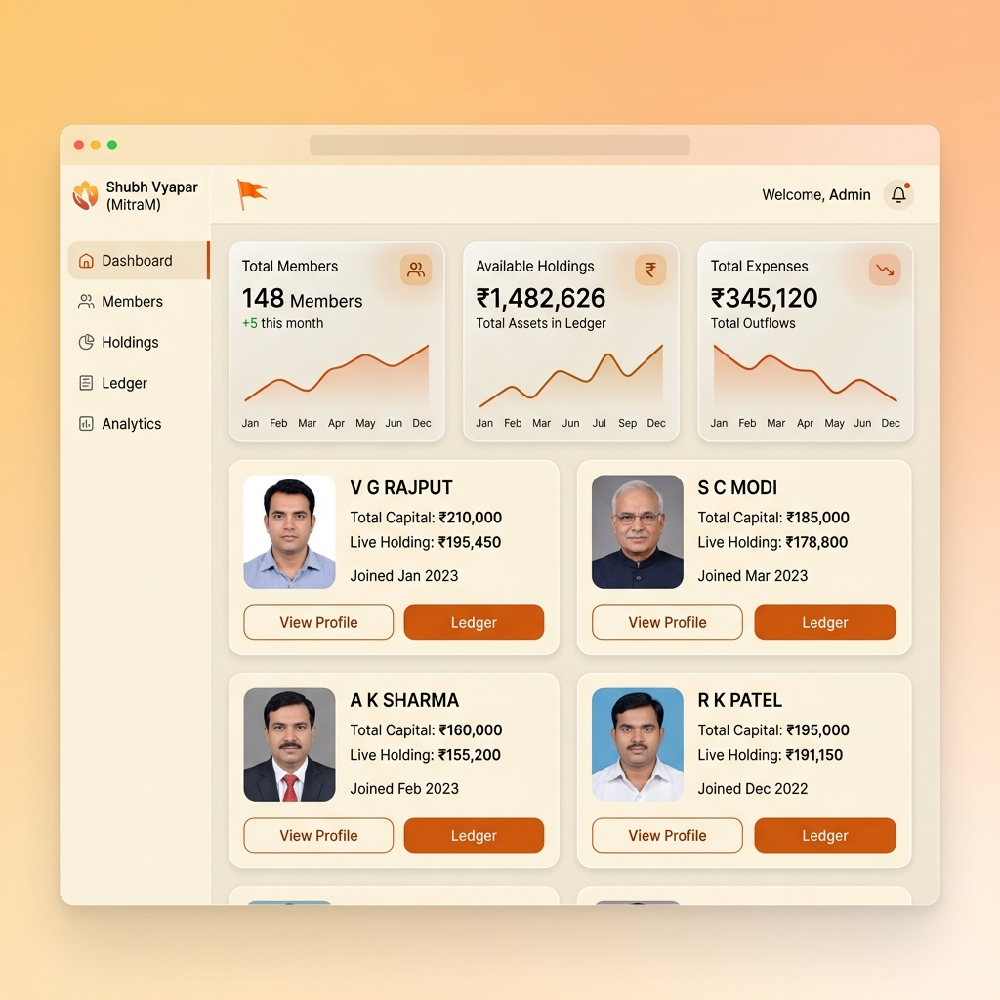
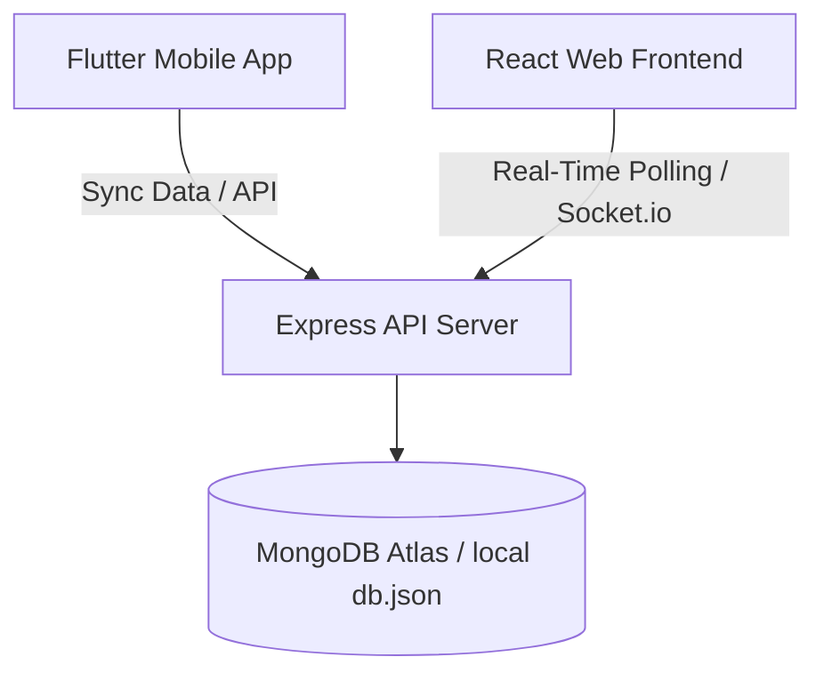

<p align="center">
  
</p>

# <p align="center">🚩 Shubh Vyapar (MitraM)</p>
<p align="center"><strong>Digital Ledger & Community Asset Management Platform</strong></p>

**Shubh Vyapar (MitraM)** is a premium, secure, and production-grade full-stack accounting system built for **Shukan Investment** (an authorized partner of **Angel One Ltd.**). It is designed to digitize traditional paper-based bookkeeping (*Chopda Pujan*) and fragmented spreadsheets for community groups, tracking member capital, expenditures, profits, and collective stock/IPO investments.

## 📱 Dashboard Preview

<p align="center">
  
</p>

The platform is fully accessible with a **bilingual interface (Gujarati & English)** designed to be highly legible and easy to use for elder community members.

---

## 🏗️ Architecture & Monorepo Structure

The project is structured as a monorepo consisting of three core parts:

```
mitraM/
├── frontend/     # Web Dashboard (React, TypeScript, Vite, TailwindCSS)
├── backend/      # API Server (Node.js, Express, MongoDB, Socket.io)
└── mobile/       # Mobile Application (Flutter, Dart)
```



---

## ⚡ Key Technical Features

*   **Bilingual Web Dashboard**: Fully localizable translation support for English and Gujarati. Includes size-optimized typography and high-contrast styling for maximum accessibility.
*   **Persistent & Cumulative Ledger**: Automates multi-year balance sheets, tracking transactions (Capital, Expense, Profit) chronologically.
*   **Active IPO/Share Holdings Tracker**: Real-time aggregation of active stock positions. Calculations are cumulative (rolling forward held positions) and display precise asset valuations.
*   **Audit Trail Logs**: Mongoose-backed real-time audit logs, documenting every ledger modification with timestamp, user ID, and custom description.
*   **Multi-Platform Access**: Admin portal built in React with Vite; member access application built in Flutter.
*   **Zero-Config Demo Mode**: Standalone frontend server using a local `db.json` file as database, enabling interactive demonstrations without any setup.

---

## 📊 Business Logic & Mathematical Calculations

To maintain strict accounting compliance between the aggregate **Master Summary** (Table 1) and individual **Member Distributions** (Table 2), the application uses the following mathematical formulas:

### 1. Remaining Amount (Cash in Hand)
Represents the liquid cash available in the pool.
$$\text{Remaining Amount (Cash)} = \max(0, \text{Income} - \text{Expense} - \text{Active Invested} + \text{Realized P\&L})$$
*   *Active Invested* is the sum of all active stock holdings purchased up to the current year.
*   *Realized P&L* is the net profit/loss from sold stocks up to the current year.

### 2. Holding (Asset Valuation)
Represents the capital currently locked up in the stock market.
$$\text{Holding} = \text{Active Invested}$$

### 3. Grand Total (Net Payout / Equity)
Represents the total payout to members (liquid cash) after withholding the stock holdings.
$$\text{Grand Total (Net Payout)} = \max(0, (\text{Income} - \text{Expense}) + \text{Profit} - \text{Holding} + \text{Gopi Mandal})$$

---

## 🚀 Quick Start (Local Demo Mode)

You can run the web dashboard locally with **zero configuration** using the mock database (`db.json`):

1.  Navigate to the frontend folder:
    ```bash
    cd frontend
    ```
2.  Install dependencies:
    ```bash
    npm install
    ```
3.  Start the standalone Express server (which hosts the mockup database and Vite bundle):
    ```bash
    npm run dev
    ```
4.  Open your browser to [http://localhost:3000](http://localhost:3000) and login with:
    *   **User ID**: Check `.env` for `ADMIN_USERNAME`
    *   **Password**: Check `.env` for `ADMIN_PASSWORD`

---

## ⚙️ Production Setup & Deployment

### 1. Database Setup (MongoDB Atlas)
1. Create a free **M0 Sandbox** database cluster on [MongoDB Atlas](https://www.mongodb.com/cloud/atlas).
2. Set up Network Access to allow connections from your hosting IP or set `0.0.0.0/0` for cloud deployment.
3. Obtain your Connection String (e.g., `mongodb+srv://...`).

### 2. Backend Server Deployment (Render)
1. Create a new **Web Service** on [Render](https://render.com) and link your repository.
2. Set the Root Directory to `backend/`.
3. Set the Build Command: `npm run build`
4. Set the Start Command: `node server.js`
5. Configure Environment Variables:
   *   `MONGODB_URI`: *[Your MongoDB connection string]*
   *   `JWT_SECRET`: *[Your custom token secret]*
   *   `NODE_ENV`: `production`
   *   `PORT`: `5000`

### 3. Frontend Web Deployment (Vercel)
1. Create a new project on [Vercel](https://vercel.com) and link your repository.
2. Set the Root Directory to `frontend/`.
3. Configure the following environment variable:
   *   `BACKEND_URL`: `https://your-backend-url.onrender.com` (points to the backend hosted on Render).
4. Deploy the application.

---

## 🛠️ Technology Stack

*   **Frontend**: React (v19), TypeScript, Vite, Lucide icons, Motion (Framer Motion).
*   **Backend**: Node.js, Express, MongoDB (via Mongoose), Socket.io.
*   **Mobile**: Flutter (v3.x), Dart.
*   **Deployment**: Vercel (Frontend), Render (Backend), MongoDB Atlas (Database).

---

## 👥 Authors & Roles
*   **Kalp Patel** — Full-Stack Developer & Software Consultant (Contractor for **Shukan Investment**)
